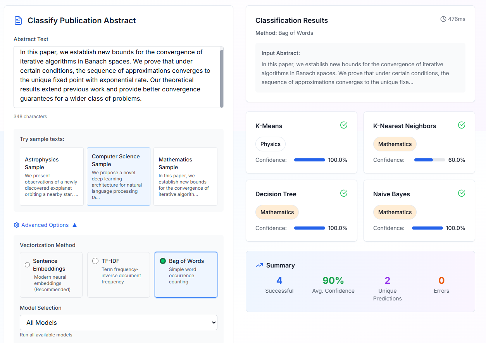

# Publication Classifier

An AI-powered web application for classifying academic publication abstracts into scientific categories using multiple machine learning approaches.

## Demo

### Interface after initializating the app.


### The example text to clasify and results of models.




## 🚀 Features

- **Multiple Vectorization Methods**: Bag of Words, TF-IDF, and Sentence Embeddings
- **4 ML Algorithms**: K-Nearest Neighbors, Decision Tree, Naive Bayes, and K-Means Clustering  
- **5 Scientific Categories**: Astrophysics, Condensed Matter, Computer Science, Mathematics, Physics
- **Real-time Classification** with confidence scores
- **Modern Web Interface** built with Next.js and TailwindCSS
- **RESTful API** with FastAPI and automatic documentation
- **Docker Support** for easy deployment

## 🏗️ Architecture

```
Frontend (Next.js) → Backend API (FastAPI) → ML Models (scikit-learn, sentence-transformers)
```

- **Backend**: FastAPI with Python, scikit-learn, sentence-transformers
- **Frontend**: Next.js 14 with TypeScript, TailwindCSS
- **ML Pipeline**: Multiple vectorization methods + classification algorithms
- **Dataset**: ArXiv abstracts from Hugging Face datasets

## 📋 Prerequisites

- Docker and Docker Compose
- Python 3.9+ (for local development)
- Node.js 18+ (for local development)
- Git

## 🚀 Quick Start with Docker

1. **Clone the repository**
   ```bash
   git clone https://github.com/trngthnh369/publication-classifier.git
   cd publication-classifier
   ```

2. **Start with Docker Compose**
   ```bash
   docker-compose up --build
   ```

3. **Access the application**
   - Frontend: http://localhost:3000
   - Backend API: http://localhost:8000
   - API Documentation: http://localhost:8000/docs

## 🛠️ Local Development

### Backend Setup

1. **Navigate to backend directory**
   ```bash
   cd backend
   ```

2. **Create virtual environment**
   ```bash
   python -m venv venv
   source venv/bin/activate  # On Windows: venv\Scripts\activate
   ```

3. **Install dependencies**
   ```bash
   pip install -r requirements.txt
   ```

4. **Run the backend**
   ```bash
   uvicorn app.main:app --reload --host 0.0.0.0 --port 8000
   ```

### Frontend Setup

1. **Navigate to frontend directory**
   ```bash
   cd frontend
   ```

2. **Install dependencies**
   ```bash
   npm install
   ```

3. **Start development server**
   ```bash
   npm run dev
   ```

## 📊 ML Models & Techniques

### Vectorization Methods

1. **Bag of Words (BoW)**
   - Simple word occurrence counting
   - Fast and interpretable
   - Good baseline for text classification

2. **TF-IDF (Term Frequency-Inverse Document Frequency)**
   - Weighs terms by importance across corpus
   - Reduces impact of common words
   - Classical NLP approach

3. **Sentence Embeddings**
   - Uses `intfloat/multilingual-e5-base` model
   - Contextual semantic understanding
   - State-of-the-art performance

### Classification Algorithms

1. **K-Nearest Neighbors (K-NN)**
   - Instance-based learning
   - Good for complex decision boundaries
   - k=5 neighbors

2. **Decision Tree**
   - Interpretable tree-based decisions
   - Handles non-linear patterns
   - No feature scaling required

3. **Naive Bayes**
   - Probabilistic classification
   - Fast training and prediction
   - Good for text classification

4. **K-Means Clustering**
   - Unsupervised clustering approach
   - Maps clusters to most common labels
   - 5 clusters for 5 categories

## 📈 API Endpoints

### Main Endpoints

- `GET /` - Health check
- `GET /health` - Detailed health status
- `GET /status` - Training status and available categories
- `POST /classify` - Classify abstract text
- `POST /initialize` - Manually trigger service initialization
- `GET /docs` - Swagger API documentation

### Example API Usage

```bash
curl -X POST "http://localhost:8000/classify" \
     -H "Content-Type: application/json" \
     -d '{
       "text": "We present observations of a newly discovered exoplanet...",
       "vectorization_method": "embeddings",
       "model_name": "knn"
     }'
```

## 🎯 Categories

The system classifies abstracts into these scientific domains:

- **astro-ph**: Astrophysics
- **cond-mat**: Condensed Matter Physics  
- **cs**: Computer Science
- **math**: Mathematics
- **physics**: Physics

## 🔧 Configuration

### Environment Variables

**Backend (.env)**
```env
ENVIRONMENT=development
API_HOST=0.0.0.0
API_PORT=8000
MODEL_CACHE_DIR=./cache
SAMPLE_SIZE=1000
ALLOWED_ORIGINS=http://localhost:3000
```

**Frontend (.env.local)**
```env
NEXT_PUBLIC_API_URL=http://localhost:8000
API_URL=http://backend:8000
```

## 📚 Dataset

Uses the `UniverseTBD/arxiv-abstracts-large` dataset from Hugging Face:
- 1000 samples for training (configurable)
- Balanced across 5 scientific categories
- Real academic abstracts from ArXiv

## 🐳 Docker Commands

```bash
# Start services
docker-compose up -d

# View logs
docker-compose logs -f backend
docker-compose logs -f frontend

# Rebuild and restart
docker-compose up --build

# Stop services
docker-compose down

# Remove volumes
docker-compose down -v
```

## 🧪 Testing

### Backend Testing
```bash
cd backend
python -m pytest tests/
```

### Frontend Testing
```bash
cd frontend
npm test
```

## 📊 Performance

- **Training Time**: ~2-3 minutes on modern hardware
- **Prediction Time**: <100ms per abstract
- **Memory Usage**: ~2GB RAM for full model loading
- **Accuracy**: Varies by method and category (60-85% typical range)

## 🚀 Deployment

### Production Deployment

1. **Update environment variables** for production
2. **Build and deploy with Docker**
   ```bash
   docker-compose -f docker-compose.yml up -d
   ```

### Cloud Deployment Options

- **AWS**: ECS/EKS with Application Load Balancer
- **Google Cloud**: Cloud Run or GKE
- **Azure**: Container Instances or AKS
- **Digital Ocean**: App Platform or Kubernetes

## 🛡️ Security Considerations

- CORS configured for specific origins
- Input validation on all endpoints
- Rate limiting recommended for production
- Environment variables for sensitive config
- Docker security best practices

## 🤝 Contributing

1. Fork the repository
2. Create a feature branch
3. Make changes and test thoroughly
4. Submit a pull request

## 📄 License

This project is licensed under the MIT License - see the LICENSE file for details.

## 🆘 Troubleshooting

### Common Issues

1. **Service initialization timeout**
   - Increase Docker memory allocation
   - Check internet connection for model downloads

2. **CORS errors**
   - Verify ALLOWED_ORIGINS environment variable
   - Check frontend API URL configuration

3. **Memory issues**
   - Reduce SAMPLE_SIZE in backend configuration
   - Increase Docker memory limits

### Getting Help

- Check logs: `docker-compose logs -f`
- API documentation: http://localhost:8000/docs
- Health check: http://localhost:8000/health

## 🔗 Related Projects

- [Hugging Face Datasets](https://huggingface.co/datasets)
- [FastAPI](https://fastapi.tiangolo.com/)
- [Next.js](https://nextjs.org/)
- [scikit-learn](https://scikit-learn.org/)
- [sentence-transformers](https://www.sbert.net/)